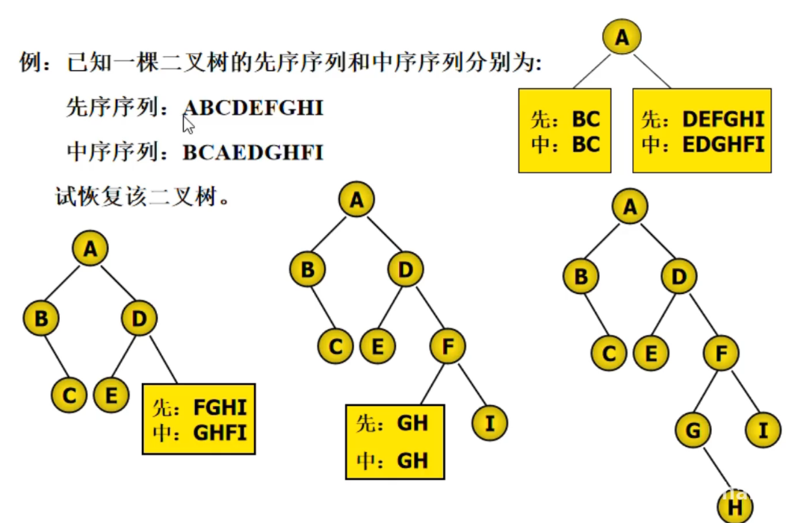

# 树和二叉树

[toc]

逻辑结构：属于树形结构

## 树的基本概念

### 树的定义与特点

- 树是 n(n >= 0)个结点的有限集合
- 有且仅有一个根结点，无任何先驱结点
- 当结点数目大于1时，除根结点外，其余结点可分为若干互不相交的集合，均可视为根结点的子树

### 树的术语

- 结点的度，每个结点所拥有子树的数目
- 叶子结点，度为0的结点，终端结点
- 分支结点，度不为0的结点
- 树的度，树的所有度的最大值
- 孩子结点，任意一个结点的子树的根结点为这一结点的孩子结点
- 兄弟结点，树中任意结点，若具有孩子结点，则这一结点为孩子结点的双亲结点
- 双亲结点，同一双亲结点的孩子结点互为兄弟结点
- 祖先结点，从根结点到任意结点所经过的结点均为祖先结点
- 子孙结点，树中以任一结点为根结点的子树中任意结点均为这一结点的子孙结点
- 结点的层次，从根结点开始定义，根结点为第一层，依次类推
- 树的深度，书中所有节点的层次的最大值

## 二叉树

### 二叉树定义与特点

二叉树是由有限元素的集合，该集合或为空，或由一个称为根的元素以及两个不相交，分别称为左子树，右子树的二叉树构成，左右子树本身也是二叉树

- 二叉树中每个结点最多有两棵树，每个结点的度小于等于2
- 二叉树是有序树，即使只有一棵子树也要进行区分
- 树，只有一个孩子时，没有左右之分
- 五种基本形态，空二叉树，根和空的左右子树，根和左子树，根和右子树，根和左右子树

### 二叉树性质

- 非空二叉树，如果叶子结点数为 n0, 度为2的节点数为 n2，则 n0 = n2 + 1

    ```text
    N = n0 + n1 + n2
    N = 分支数 + 1
    分支数 = n1 + 2 * n2
    N = n1 + 2 * n2 + 1
    n0 = n2 + 1
    ```

- 非空二叉树，第i层上最多有 `2 ^ (i-1)` 2的i-1次方 个结点
- 深度为 k 二叉树，最对有 `(2 ^ k) - 1` 个结点，满二叉树
- 完全二叉树，叶子结点只能出现在最下层和次下层，且最下层的叶子结点集中在树的左部
  - 二叉树除最后一层外每一层都是满的
  - 最后一层或者是满的，或者结点连续地集中在该层地最左端
- 具有n个结点的完全二叉树的深度为 `log2(n)` 向下取整 + 1
  - `2 ^ (k-1) <= n <= (2 ^ k) - 1`，取对数
- 对于n个结点的完全二叉树，按层序编号，对任一结点 i
  - i == 1 则 结点 i 是根结点，无双亲，如果 i > 1 则双亲结点是结点 `i / 2` 向下取整
  - 如果 `2*i <= n` 则其左孩子结点是 `2*i`, 否则无左孩子结点，是叶子结点
  - 如果 `2*i+1 <= n` 则右孩子结点是结点 `2*i+1`, 否则无右孩子结点

## 二叉树的实现

完全二叉树--顺序存储
一般树--链式存储

### 顺序存储实现二叉树

二叉树中结点的序号可以唯一反映出节点之间的逻辑关系

列表，[left, data, right]

### 链式存储实现二叉树

```python
class BNode(object):
    def __init__(self, data=None, l_child=None, r_child=None):
        self.data = data
        self.l_child = l_child
        self.r_child = r_child
```

#### 二叉链表

```text
node: pre--data--next
node: l_child--data--r_child
n 个结点的二叉链表，2*n 个指针域，用掉了 n-1 个指针域，还有 n+1 个空指针域
```

```python
class BNode(object):
    def __init__(self, data=None, l_child=None, r_child=None):
        self.data = data
        self.l_child = l_child
        self.r_child = r_child
```

#### 三叉链表

```text
node l_child--data--parent--r_child
可以方便查找孩子结点和双亲结点，增加了开销
```

## 建立二叉链表存储结构的二叉树

设每个元素是一个字符，输入先序序列，按先序遍历的顺序，建立二叉链表所有的结点并完成相应结点的链接
只能是先序遍历建立

```python
def createBT():
    ch = input('please input one char:')
    if ch == '*':
        T = None
    else:
        T = Node()
        T.data = ch
        T.l_child = create_btree()
        T.r_child = create_btree()
    return T
```

## 遍历二叉树

### 遍历逻辑

```text
D访问根，L遍历左子树，R遍历右子树
根出现的顺序，先，中，后
DLR， LDR， LRD
遍历时迭代往下
```

```text
    A
  B   C
   D

    A
  B   C
D   E   F
   G

先序遍历，访问根结点，先序遍历根结点的左子树，先序遍历根的结点的右子树
  ABDC
  ABDEGCF
中序遍历，中序遍历根结点的左子树，访问根结点，中序遍历根结点的右子树
  BDAC
  DBGEACF
后序遍历，后序根结点的左子树，后序遍历根结点的右子树，访问根结点
  DBCA
  DGEBFCA

a + b * (c - d) -e / f
先序，-+a*b-cd/ef，波兰式
后序 abcd-*+ef
```

### 实现三种遍历


```text
先序
  ABDFJGKCEHILM
中序
  BFJDGKACHELIM
后序
  JFKGDBHLMIECA
```

```python
def pre_traverse(T: BNode):
    if T is None:
        return
    print(T.data)
    pre_traverse(T.l_child)
    pre_traverse(T.r_child)


def mid_traverse(T: BNode):
    if T is None:
        return
    pre_traverse(T.l_child)
    print(T.data)
    pre_traverse(T.r_child)


def post_traverse(T: BNode):
    if T is None:
        return
    post_traverse(T.l_child)
    post_traverse(T.r_child)
    print(T.data)
```

### 统计二叉树叶子节点数目

1，借助遍历算法，递归操作，访问到结点，判断是否是叶子结点
2，计数器

```python
n = 0


def count_leaf(T: BNode):
    if T is None:
        return
    if T.l_child is None and T.r_child is None:
        global n
        n += 1
    count_leaf(T.l_child)
    count_leaf(T.r_child)
```

### 非递归遍历

先序，中序，后序便利过程中经过结点的路线是相同的，只是访问的时机不同

- 先序，遇到结点就访问
- 中序，左子树返回时遇到结点就访问
- 后序，从右子树返回时遇到结点就访问

栈

```python
def pre_order(root):
    """借助一个堆栈，按照父亲节点、左孩子、右孩子的顺序压到堆里面，每次弹出栈顶元素"""

    stack = []
    while stack or root:
        while root:
            print(root.data)
            stack.append(root)
            root = root.l_child
        root - stack,pop()
        root = root.r_child()


def mid_order(root):
    """遍历顺序与先序不同"""

    stack = []
    while stack or root:
        while root:
            stack.append(root)
            root = root.l_child
        root = stack.pop()
        print(root.data)
        root = root.r_child


def post_order(root):
    """有左孩子，就遍历左孩子，没有，就转到右孩子"""

    stack = []
    while stack or root:
        while root:
            stack.append(root)
            root = root.l_child if root.l_child else root.r_child
        root = stack.pop()
        print(root.data)
        if stack and stack[-1].l_child == root:
            root = stack[-1].r_child
        else:
            root = None
```

## 恢复二叉树

先序+中序序列 -> 二叉树 -> 后序
后序+中序序列 -> 二叉树 -> 先序

1, 由二叉树先序序列的第一个结点确定树/子树的树根R
2, 将二叉树的中序序列分为左子树中序序列和右子树序列
3，将左右子树按相同方法进行恢复



```text
1, 先序序列的第一个结点，A 把中序序列分为 左子树和右子树
2, 确定左子树
3，新的先序序列的第一个结点把新的右子树分为左右子树

```

## 哈夫曼树

### 哈夫曼树的定义

- 路径，从一个祖先结点到子孙节点之间的分支结构成两结点间的路径
- 路径长度，路径上的分支数目称为路径长度
- 结点的权，在树的结点上赋一个某种意义的实数，称此实数为该结点的权
- 结点的带权路径长度，从根到该结点的路径长度与该结点权的乘积
- 树的带全路径长度，树中所有结点的带权路径之和
- 哈弗曼树，假设有 n 个权值(W1, W2,..., Wn), 构造有 n 个叶子结点的二叉树，每个叶子结点有一个 Wi 作为权值,带权路径长度最小的为哈弗曼树
- 权值大的靠近根结点，权值小的远离根结点

### 哈弗曼树的建立

```text
1, 将 n 个权值{W1,W2..Wn}对应n个结点，构成具有n棵二叉树的森林F{T1,T2..Tn}，其中每棵二叉树Ti(1<=i<=n)
    都只有一个权值为Wi的根结点，其左右子树为空
2，在森林F中选出两棵根结点权值最小的树a,b作为一棵新树的左右子树，且设置新树的根结点的权值为其左右子树根结点的权值之和
3，在F中删除a,b，同时把新树放进森林中
4，重复，2，3，直到F中有一个元素为止，即根
```

```text
W = {5, 29, 7, 8, 14, 23, 3, 11}

29, 7, 8, 14, 23, 11, [3, 8, 5]

29, 14, 23, 11, [3, 8, 5], [7, 15, 8]

29, 14, 23, [7, 15, 8], [[3, 8, 5], 19. 11]

29, 23, [[3, 8, 5], 19. 11], [14, 29, [7, 15, 8]]

29, [14, 29, [7, 15, 8]], [[[3, 8, 5], 19. 11], 42, 23]

[[[3, 8, 5], 19. 11], 42, 23], [29, 58, 29, [14, 29, [7, 15, 8]]]

[[[[3, 8, 5], 19. 11], 42, 23], 100, [29, 58, 29, [14, 29, [7, 15, 8]]]]
```

### 代码实现哈弗曼树

```python
class HuffmanNode():
    def __init__(self, data):
        self.data = data
        self.l_child = None
        self.r_child = None
        self.parent = None


def create_huffman_tree(nodes: list):
    node_lis = nodes[:]

    while len(node_lis) > 1:

        # 根据数据域值排序
        node_lis.sort(key=lambda item: item.data)

        # 取出最小元素为左孩子
        node_left = node_lis.pop(0)
        # 取出次小结点为右孩子
        node_right = node_lis.pop(0)

        # 生成父结点
        node_parent = HuffmanNode(data = node_left.data + node_right.data)

        # 修复父结点的孩子结点
        node_parent.l_child = node_left
        node_parent.r_child = node_right

        # 修改孩子结点的父结点
        node_left.parent = node_parent
        node_right.parent = node_parent
    
        # 把新的结点加入到列表中
        node_lis.append(node_parent)
    

    # 最后一个结点是根结点
    node_lis[0].parent = None
    return node_lis[0]
```

## 哈弗曼编码

### 哈夫曼编码概念

依据字符出现的概率来构造异字头的平均长度最短的码字

哈弗曼树解决二义性与最短编码

- 1 统计字符集中每个字符在电文中出现的概率，概率越大编码越短
- 2 构造哈弗曼树
- 3 在哈弗曼树上，做分支记为0，右分支记为1
- 4 从根到每个叶子结点的路径上标记连接起来，作为该叶子的编码
- 5 每个字符结点都在叶子结点上，不会出现在其他根结点到其他字符结点的路径上

### 代码实现哈弗曼编码

```python
class Node(object):
    def __init__(self, weight, name=None):
        self.weight = weight
        self.name = name
        self.l_child = None
        self.r_child = None
        self.parent = None


def create_haffman_nodes(char_weights):
    nodes = [Node(weight=weight, name=value) for value, weight in char_weights.items()]
    return nodes


def create_haffman_tree(node_lis: list):
    # 生成结点
    nodes = node_lis[:]

    while len(nodes) > 1:
        nodes.sort(key=lambda node: node.weight)
        # 取出最小元素为左孩子
        node_left = nodes.pop(0)
        # 取出次小结点为右孩子
        node_right = nodes.pop(0)

        # 生成父结点
        node_parent = Node(weight = node_left.weight + node_right.weight)

        # 修复父结点的孩子结点
        node_parent.l_child = node_left
        node_parent.r_child = node_right

        # 修改孩子结点的父结点
        node_left.parent = node_parent
        node_right.parent = node_parent

        # 把新的结点加入到列表中
        nodes.append(node_parent)

    root = nodes[0]
    return root


def huffman_encoding(nodes, root: Node):
    codes = [''] * len(nodes)
    code_dic = {}

    for i in range(len(nodes)):
        node = nodes[i]
        
        while node != root:
            if node == node.parent.l_child:
                codes[i] = '0' + codes[i]
            else:
                codes[i] = '1' + codes[i]

            code_dic[nodes[i].name] = codes[i]
            node = node.parent

    return codes, code_dic


weights = {
    'a': 4,
    'b': 7,
    'c': 2,
    'd': 5
}

node_lis = create_haffman_nodes(weights)

root = create_haffman_tree(node_lis)

codes, code_dic = huffman_encoding(node_lis, root)
print(codes)
print(code_dic)


```
