# 图

[toc]

图：Graph
逻辑结构属于图形结构
抽象的数学结构

## 图的性质和概念

### 图的定义和图示

图由两个集合构成，`G=<V, E>`, V(vertex)是**顶点**的非空有限集合，E(edge)是**顶点间的关系-边**的有限集合，边是顶点的无序或有序对集合

- 顶点：数据元素 Vi 称为顶点
- 边和弧，P(Vi, Vj)表示在顶点Vi,和Vj之间的有线相连，无向图则为边，有线图则为弧
- 边 无序偶对(Vi, Vj)，弧 有序偶对 `<Vi, Vj>`

无向图

```text
G = <V, E>
V = {V0, V1, V2, V3}
E = {(V0, V1), (V0, V3), (V1, V2), (V1, V4), (V2, V3), (V2, V4)}

无序对 (Vi, Vj), 顶点之间 Vi Vj 的线段称为无向边
所有边都没有方向，则为无向图
```

有向图

```text
G = <V, E>
V = {V0, V1, V2, V3}
E = {<V0, V1>, <V0, V2>, <V2, V3>, <V3, V0>}

有序对 <Vi, Vj> 从Vi到Vj的有向线段，有向弧，起点为弧尾，终点为弧头
若所有顶点之间的连线均为有方向，则为有向图
```

边上带权的图为网

```text
边的权
图的边/弧相关的数据信息称为权
```

无向完全图

```text
在无向图中，任意两个顶点之间都有一条边连接，则称为无向完全图，
n个顶点的无向完全图边数为n * (n - 1) / 2
```

有向完全图

```text
任意两个顶点之间都有方向互为相反的两条弧连接，则称该有向图为有向完全图
n个顶点的有向完全图边数为 n * (n - 1)
```

### 图中关系的术语，概念，性质

```text
邻接：表示两顶点之间的关系，若Vi 和 Vj 间有边相连接，则Vi Vj 互称邻接点
关联：边和顶点的关系，若Vi 和 Vj 间有边相连接，边 (Vi, Vj)关联于顶点Vi, Vj
顶点的度，入度，出度
    : 顶点V的度，关联于某定点V的边的数目
    入度，出度，有向图

顶点数n，边数e, 度的关系
所有顶点度数之和为 2 * e

路径：连续的边构成的顶点序列
路径长度：非带权图的路径长度是指此路经上边的条数，带权图的路径长度是指路径上各弧的权值之和
回路：起点和终点相同的路径
简单路径：起点与终点可以相同，其余顶点均不相同的路径
简单回路：除路径起点和终点相同外，其余顶点均不相同的回路
有根图：存在一个顶点，到其他顶点均有路径
(强)连通图：任意两顶点均连通，叫连通图
子图：G=(V, E) G`=(V`, E`) 若 V` 属于 V, 且 E` 属于 E，则G`是G的子图

连通分量：无向图的极大连通子图称为G的连通分量
    该子图是连通子图(连通，子图),将G的任何不属于该子图中的顶点加入，子图不再连通
极小连通子图：在连通子图中，删去任意边后，不再连通

具有n个顶点的强连通图，至少n条边(环路)
具有n个顶点的连通图，至少n-1条边
```

### 图的抽象数据类型

- 顶点数，边数，顶点集合，边集合，加入顶点，加入边
- 获取边信息，度

图中要保存顶点的数据，顶点间的关系

## 顺序存储

### 邻接矩阵

表示顶点间邻接关系的矩阵

- 一个顶点表，记录各个顶点信息，[V0, V1, V3, ..., Vn]
- 一个邻接矩阵，表示各个顶点之间关系，n个顶点的图的邻接矩阵是一个 n 阶方阵

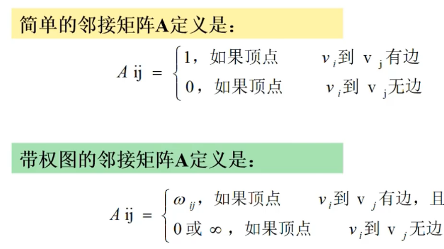

#### 无向图的邻接矩阵

- 无向图的邻接矩阵是对称矩阵
- 顶点 i 的度 = 第 i 行(列)中 1 的个数，完全图的邻接矩阵中对角元素为0，其余为1

#### 有向图的邻接矩阵

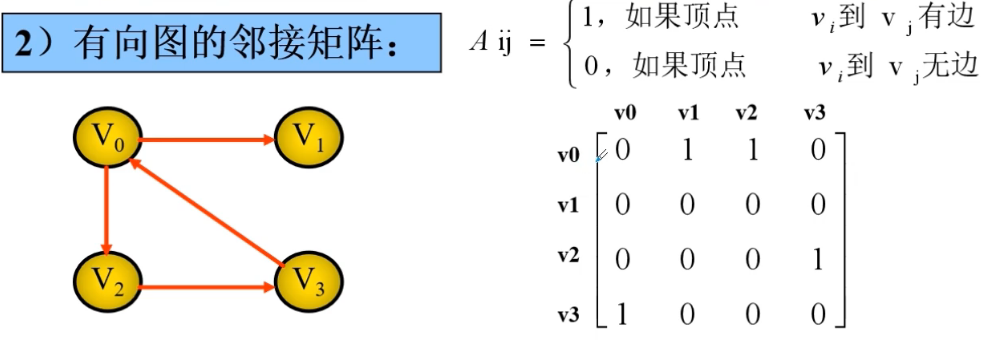

行：元素之和 出度
列：元素之和 入度

#### 带权图、网的邻接矩阵

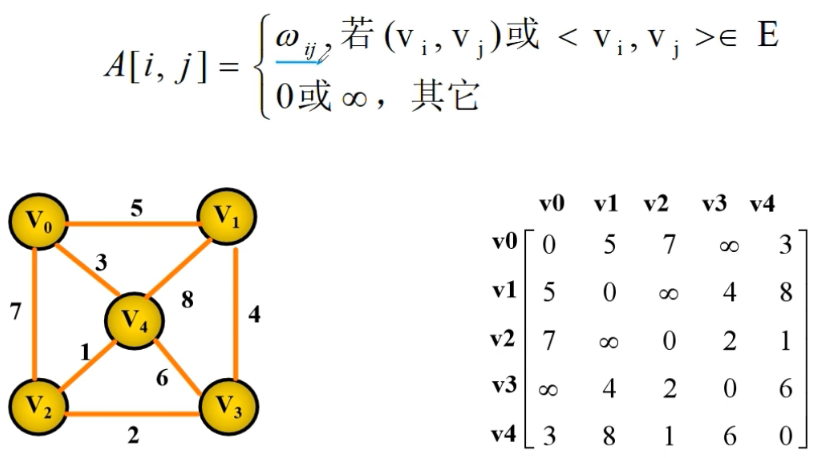

### 邻接矩阵的存储实现

- 确定总顶点数和总边数
- 构造顶点集合的列表
- 构造邻接矩阵的列表

```python
class GraphAX:
    def __init__(self, vertex, matrix):
        self.vertex = vertex  # 顶点表
        self.vnum = len(vertex)  # 顶点数
        self.matrix = [matrix[i][:] for i in range(vnum)]  # 关系矩阵
        # self.mat = mat  # 关系矩阵

    def get_edge(self, v_i, v_j):
        if v_i not in self.vertex or v_j not in self.vertex:
            print('无效顶点')
            return False
        e_i, e_j = self.vertex.index(v_i), self.vertex.index(v_j)
        return bool(self.matrix[e_i][e_j])


def create_matrix():
    nodes = ['v0', 'v1', 'v2', 'v3', 'v4']
    matrix = [
        [0, 1, 0, 1, 0],
        [1, 0, 1, 0, 1],
        [0, 1, 0, 1, 0],
        [1, 0, 1, 0, 0],
        [0, 1, 1, 0, 0]
        ]
    
    graph = GraphAX(vertex=nodes, matrix=matrix)
    print(graph.get_edge('v1, v3'))
    print(graph.get_edge('v0', 'v1'))

```

#### 邻接矩阵优点

- 统计顶点的度
- 顶点不变，增删边时只需对应元素赋为1或0
- 判断任意两顶点之间是否相连
- 统计图中有多少边

#### 邻接矩阵缺点

- 不便于删除结点
- 浪费空间， O(n^2)
- 浪费时间，O(n^2)

## 顺序和链式存储结合

### 邻接表

- 为图中每个顶点建立单链表
- 第i个单链表中的节点表示依附于顶点Vi的边，有向图中指以Vi为尾的弧

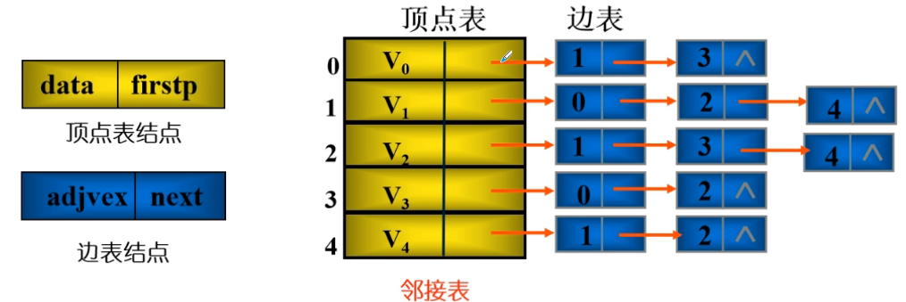

```text
V0
    V0 - V1
    V0 - V3
V1
    V1 - V0
    V1 - V2
    V1 - V4
```

#### 邻接表特点

- 开辟空间大小与顶点数和边数有关
- 可以求顶点v的度
- 判定两顶点是否邻接
- 增删边
- 统计边数

#### 邻接表的定义与实现

第三方库，**networkx**

```python
class Anode:
    """边表结点"""

    def __init__(self, adjvex, weight=0, next=None):
        self.adjvex = adjvex  # 关联的边，顶点
        self.weight = weight  # 边上的权
        self.next = next  


class Vnode:
    """顶点表结点"""

    def __init__(self, data, head=None):
        self.data = data
        self.head = head  # 顶点表头指针


class Graph:
    def __init__(self):
        self.verts = []
        self.num_vertices = 0

    def add_vertex(self, key):
        """插入顶点元素"""

        vertex = Vnode(key)
        self.verts.append(vertex)
        self.num_vertices += 1
        return vertex

    def add_edge_operate(self, key):
        i = 0

        while i < len(self.verts):
            if key == self.verts[i].data:
                # 判断 key 是否在顶点表中
                v_node = self.verts[i]
                break
            i += 1
        if i == len(self.verts):
            # key 不在顶点表中

            v_node = self.add_vertex(key)
            # key 加入到 顶点表

        return v_node

    def add_edge(self, key_a, key_b, weight=None):
        
        v_a = self.add_edge_operate(key_a)
        v_b = self.add_edge_operate(key_b)

        # 找到顶点表中的下标索引
        v_b_index = self.verts.index(v_b)  

        # 生成边表结点，修改边表指针
        p = Anode(v_b_index, weight, v_a.head)

        v_a.head = p  # 修改顶点表指针
```

#### 无向图邻接表

- 不唯一
- n个结点，e条边的无向图，则其邻接表需n个头结点和2*e个表结点，适合稀疏图
- 顶点Vi的度是第i个边表中结点数

#### 有向图邻接表

邻接表，把以同一顶点为起点的弧存储在边表
逆邻接表，把以同一顶点为终点的弧存储在边表

- 顶点Vi的出度为第i个子单链表中结点数
- 顶点Vi的入度为整个邻接表中邻接点阈值是下标为i的结点个数
- 邻接表算出度，逆邻接表算入度

#### 网的邻接表

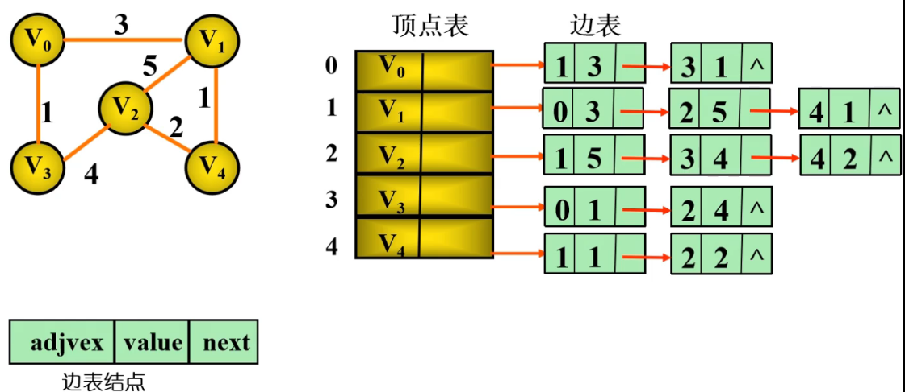

```text
V0
    V0 - V1 3
    V0 - V3 1
V1
    V1 - V0 3
    V1 - V2 5
    V1 - V4 1
```

## 图的基本运算

1 图的遍历

从连通图的某顶点出发，仅一次地访问图中所有的顶点
访问每个顶点的邻接点

- 起始点，按顶点列表存储顺序进行访问
- 避免重复，每个顶点设一个访问标志
- 深度优先，DFS, 广度优先，BFS

### 深度优先遍历图

```text
从图的某一顶点 V0，访问此顶点
依次从V0未被访问过的邻接点出发，深度优先遍历图，直至所有和V0连通的顶点都被访问到
若有未被访问到的顶点，则选择一个未被访问的顶点作为起点
重复，直至全部访问到
```

回退操作，非递归时，采用栈来辅助

#### 邻接矩阵深度优先遍历图

时间复杂度 O(n^2)

```python

```

#### 邻接表深度优先遍历图

时间复杂度 O(n+e) e 为边数/弧数

### 广度优先遍历图

```text
从图的某一顶点 V0，访问此顶点
依次从V0未被访问过的邻接点出发，广度优先遍历图，直至所有和V0连通的顶点都被访问到
若有未被访问到的顶点，则选择一个未被访问的顶点作为起点
重复，直至全部访问到
```

辅助数据结构为队列

#### 邻接矩阵广度优先遍历图

时间复杂度 O(n^2)

```python

```

#### 邻接表广度优先遍历图

时间复杂度 O(n+e)

```python

```

## 图的生成树

- n的顶点的无向连通图，最少(n - 1)条边
- **路径**：连续的边构成的顶点序列
- **回路**：起点和终点相同的路径
- **(强)连通图**：任意两顶点均连通，叫连通图
- **生成树**: 包含了无向连通图G所有顶点，但不存在回路的连通图，是原图的一个极小连通子图

--------------------------------------------------------------------

- 生成树中顶点数和图中的顶点数相同
- 极小：连通子图中删除任意一边，便不再连通
- n的顶点的连通图，最多(n - 1)条边，再加一条边，便会出现回路
- 多棵生成树

### 深度优先遍历生成树

### 广度优先遍历生成树

## 最小生成树

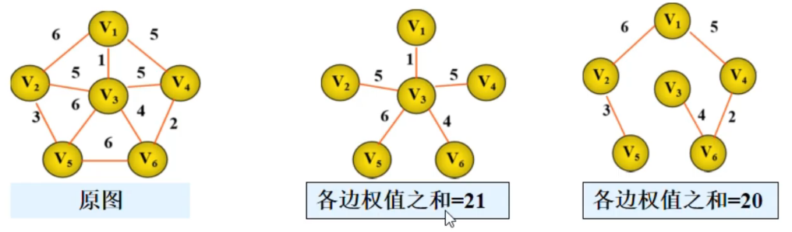

- 最小生成树：对于一个网络，所有生成树中边权值最小的为最小生成树
- 假设N=(V, E) 是一个连通网,U是顶点集V的一个非空子集，某个顶点u1属于U,某个顶点u2属于V-U,
    若(u1, u2)是一条具有最小权值的边，则必存在一棵包含边(u1, u2)的最小生成树

### prim 普里姆算法

选择点

- 设连通网 N={V, E}
- 集合
  - 集合U存放G的最小生成树中的结点
  - 集合T存放最小生成树之外的顶点
  - 集合TE存放N上最小生成树中边
- 初始 U={u, 0}, TE={}, T=V-U
- 在所有U-T中，找一条代价最小且不构成回路边(u0, v0)加入到TE，并把顶点加入U
- 重复，直到U=V,则T=(V, TE)为最小生成树

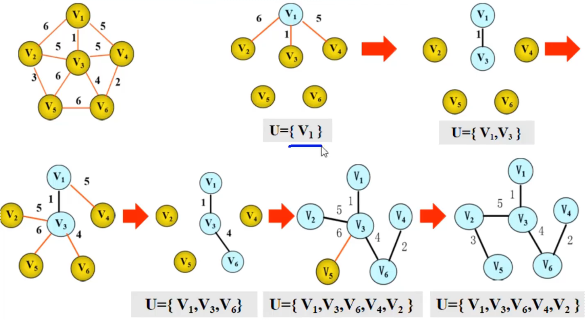

时间复杂度：O(n)，稠密图

### kruskal 克鲁斯卡尔算法

选择边，按照网中权值递增的顺序构造最小生成树

- 设连通网G=(V, E),令最小生成树初始状态是只有n个顶点而无边的非连通图,T=(V, null)
- 在E中选取代价最小的边，若该边依附的顶点落在T中不同的连通分量上，且不构成回路，将此边加入T
    否在舍去此边，选下一条代价最小的边
- 重复，直到T中所有丁点都在同一连通分量上

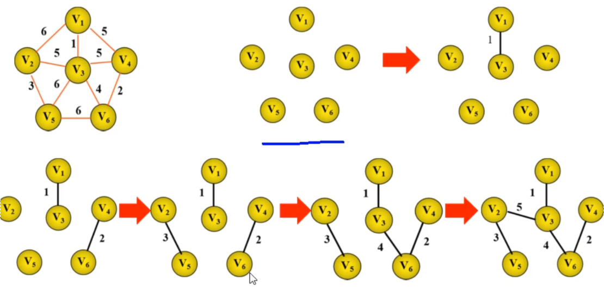

时间复杂度： O(e log e)，稀疏图

## 图的最短路径

从某一个顶点A出发，在到达另一顶点B的所有路径中边权值和最小的一条路径--最短路径问题
第一个顶点-源点，最后一个顶点为终点

### 迪杰斯特拉求单源点最短路径

给定一个带权有向图D与源点V，求V到D中其他顶点的最短路径

首先求出长度最短的一条最短路径，再参照它求出长度次短的一条最短路径，
直到顶点V到其他各顶点的最短路径全部求出

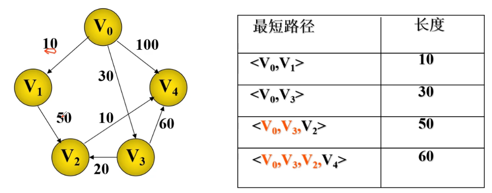

- 初始，找到从源点到其他各终点的直达路径
- 选取，从这些路径中选取最小值为最小路径
- 对其余顶点上路径进行修改，若存在(vo, vi)，且(v9, vk)+(vk, vi) < (v0, vk) 则以路径(v0, vk, vi)代替(v0, vk)
- 重复2，3，直到包含全部顶点

```text
dist[]: dist[i] 表示当前找到的从源点到Vi的最短路径的长度
pre[]: pre[i] 表示从源点到Vi的最短路径上，Vi的前一顶点的序号，若从源点到Vi没有路径，则-1
visit[]: visit[i] 表示从源点到Vi的最短路径是否求出，0表示没有求出，1表示已求出
```

### 弗洛伊德算法多源点求最短路径

加权图中所有顶点间的最短路径

## AOV 网，拓扑排序

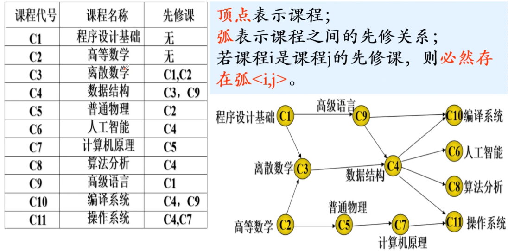

只有有向无环图才有拓扑序，所以有向无环图又被称为拓扑图

- 拓扑序列：有向图D的一个顶点称作一个拓扑序列

    该序列中任两顶点v, u，若在D中v在u之前，在序列中v也在u之前

- 拓扑排序：把AOV网络中各顶点按照他们相互之间的领先关系排列成一个线性序列的过程

### 拓扑排序算法

- 1 在 AOV 网中选一个没有前驱的顶点，并将其输出
- 2 在网中删除顶点v和所有以v为尾的弧
- 3 重复 1，2，直至全部顶点均已输出，或者不存在无前驱的结点为止

### 拓扑排序的算法实现

用栈存入所有入度为0的顶点

- 1 将所有入度为0的顶点入栈
- 1 当栈非空时重复执行下列操作
  - 1 从栈中弹出顶点k
  - 2 将顶点k的信息输出
  - 3 将与k邻接的所有顶点的入度减1，如果某顶点的入度为0，则入栈

## AOE 网，关键路径

用边表示工程活动的有向网，有向无环图，用活动来表示子任务

- 顶点表示事件
- 弧表示活动
- 弧上的权值表示活动持续时间

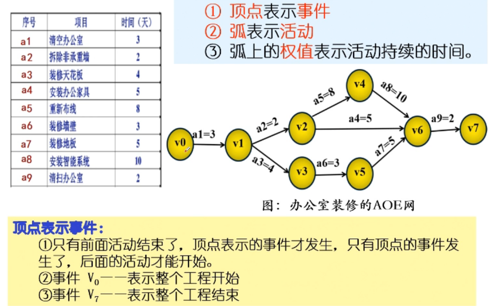

工程时间估算

关键路径：完成整个工程所需时间取决于从源点到终点的最长路径长度，
该路径所有活动持续时间之和，此路径为关键路径

- 时间余量：活动最迟开始时间与最早开始时间的差额
- 关键活动：如果一个活动的时间余量为0，就意味着该活动不能拖延时间，称为关键活动，必须立即完成，否则就将拖延整个工期
- 关键路径：时间余量为0的所有边连起来，就是关键路径
  - 关键路径上的所有活动都是关键活动， 它是决定整个工程的关键因素，因此可以通过加快关键活动来缩短整个工期
  - 只有加快存在于所有关键路径上的关键活动才能达到缩短工期的目的

### 计算关键路径

属性

- 事件Vk的最早可能发生时间Ve(Vk)
  - Ve(v1) = 0 开始递推，Ve(Vk) = Max{Ve(vj) + dut(<j, k>)}
  - **前面的都结束**
- 事件Vk的最迟允许发生时间Vl(Vk)
  - Vl(Vn)=Ve(Vn) 开始递推，Vl(Vk) = Min{Vl(vj) - dut(<k, j>)}
  - **从后往前**
  - 该事件的可能发生的时间减去活动的持续时间的最小值
  - 事件最迟发生时间减去活动持续时间的最小值
  - **下一事件最迟发生时间减去活动持续时间的最小值**

- 活动ai的最早可能开始时间
  - 弧<k, i> 有活动 i, 则 ae(i) = Ve(k)
  - ae(ak) = Ve(ai)
  - 弧尾最早发生时间
- 活动ai的最迟开始时间l(ai)
  - 边<k, j> 活动 i, 则 al(i) = Vl(j) - dut(k, j)
  - 活动最晚时间即**弧头最迟发生时间减去活动持续时间**

- 活动的事件余量al(ai) - ae(ai)
- 活动的最早发生时间和最晚发生时间相等，则说明该活动时属于关键路径上的活动，即关键活动

### 关键路径的算法实现

n顶点，e条弧

时间复杂度，在拓扑序列求Ve[i]和逆拓扑序列求Vl[i]，需O(n+e)
求各活动e[k]和l[k]时需O(e)

- 1 输入顶点和弧信息，建立AOE网
- 2 计算每个顶点的入度
- 3 从源点V1出发, Ve[1] = 0,进行拓扑排序，求各顶点Ve[i]
  - 1 排序过程中求顶点的Ve[i]的最大值
  - 2 将得到的拓扑序列进栈，得到逆拓扑序列
- 4 从汇点Vn出发。令Vl[n] = Ve[n],按逆拓扑序列求其余各顶点的Vl[i]的最小值
- 5 根据各定点的Ve和Vl值，计算每条弧的最早开始e[i]和最晚开始l[i]，找出关键活动
