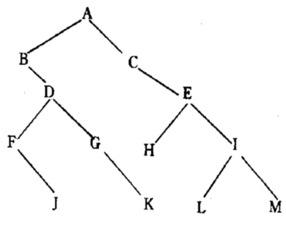
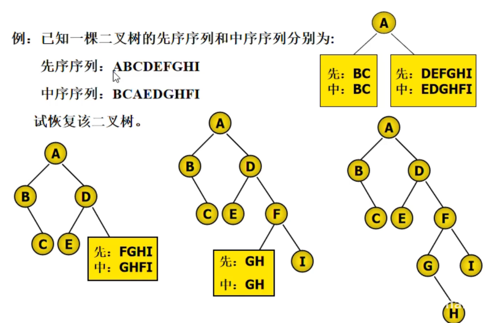
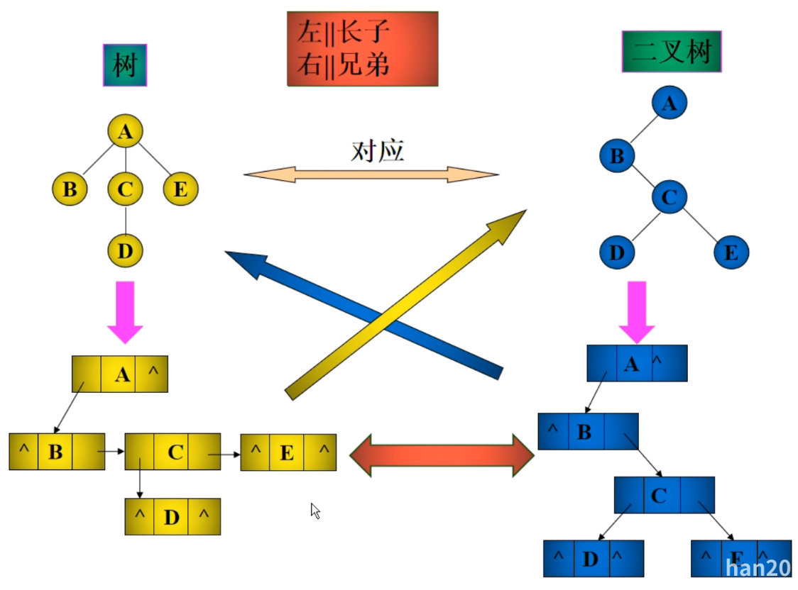
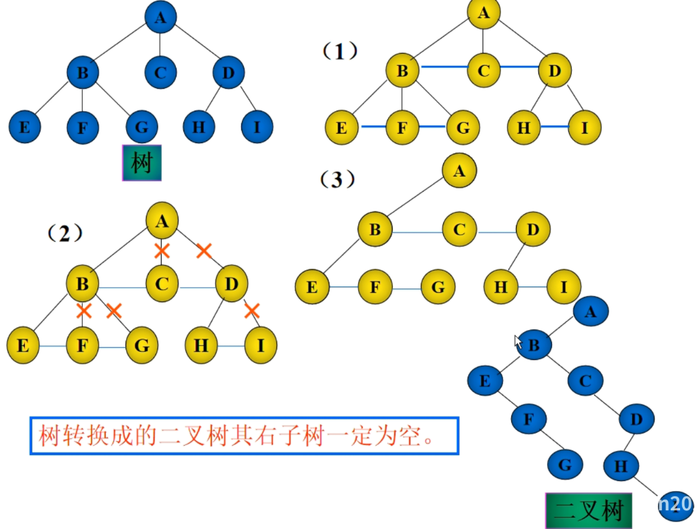
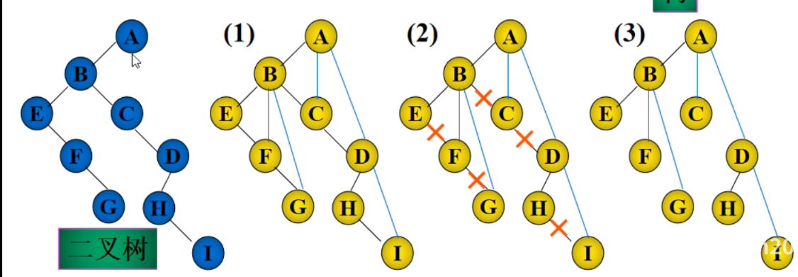
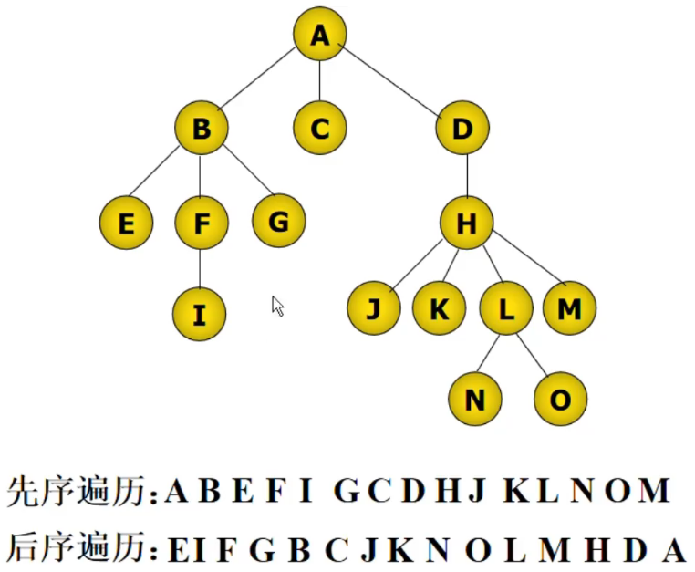
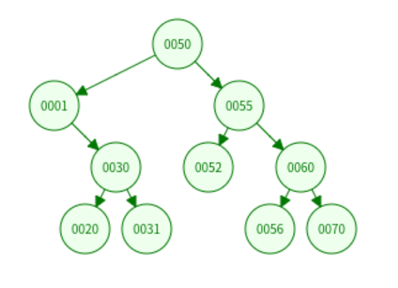

# 树和二叉树

[TOC]

## 0

逻辑结构：属于树形结构

## 1 树的基本概念

### 1.1 树的定义与特点

- 树是 n(n >= 0)个结点的有限集合
- 有且仅有一个根结点, 根结点无任何先驱结点
- 当结点数目大于1时, 除根结点外, 其余结点可分为若干互不相交的集合, 均可视为根结点的子树

### 1.2 树的术语

- 结点的度: 结点所拥有的的子结点的数目, 每个结点所拥有子树的数目
- 树的度: 树的所有结点的度的最大值为树的度
- 结点的层次: 从根结点开始定义, 根结点为1层, 依次类推
- 树的深度: 树中所有结点的层次的最大值为树的深度
- 祖先结点: 从根结点到任意结点所经过的结点均为祖先结点
- 孩子结点: 与本结点直接向下相连的结点, 任意一个结点的子树的根结点为这一结点的孩子结点
- 叶子结点: 度为0的结点, 终端结点, 没有孩子节点
- 分支结点: 度不为0的结点
- 双亲结点: 树中任意结点, 若具有孩子结点, 则这一结点为孩子结点的双亲结点
- 兄弟结点: 同一双亲结点的孩子结点互为兄弟结点
- 子孙结点: 树中以任一结点为根结点的子树中任意结点均为这一结点的子孙结点

## 2 二叉树

### 2.1 二叉树定义与特点

二叉树是由有限元素的集合, 该集合或为空, 或由一个称为根的元素以及两个不相交, 分别称为左子树, 右子树的二叉树构成, 左右子树本身也是二叉树

- 二叉树中每个结点最多有两棵树, 每个结点的度小于等于2
- 二叉树是有序树, 即使只有一棵子树也要进行区分
- 树, 只有一个孩子时, 没有左右之分
- 五种基本形态, 空二叉树, 根和空的左右子树, 根和左子树, 根和右子树, 根和左右子树

### 2.2 二叉树性质

- 非空二叉树, 如果叶子结点数为 n0, 度为2的节点数为 n2, 则 n0 = n2 + 1

    ```text
    N 为结点总数, E 为边数

    N = n0 + n1 + n2
    E = n1 + 2 * n2 每个结点只有一条边与父结点连接
    N = E + 1

    N = n1 + 2 * n2 + 1

    n0 = n2 + 1
    ```

- 非空二叉树, 第i层上最多有 `2 ^ (i-1)` 2的i-1次方 个结点
- 深度为 k 二叉树, 最多有 `(2 ^ k) - 1` 个结点, 满二叉树时是最大值
- 满二叉树: 所有分支结点都有左右子树, 而且叶子结点都在同一层 (2^n)-1个结点
- 完全二叉树, 叶子结点只能出现在最下层和次下层, 且最下层的叶子结点集中在树的左部
  - 二叉树除最后一层外每一层都是满的
  - 最后一层或者是满的, 或者结点连续地集中在该层地最左端
  - 只有最后一层有空缺, 而且所有叶子结点均按照从左往右排列, 满二叉树是完全二叉树
- 具有n个结点的完全二叉树的深度为 `log2(n)` 向下取整 + 1
  - `2 ^ (k-1) <= n <= (2 ^ k) - 1`, 取对数
- 对于n个结点的完全二叉树, 按层序编号, 对任一结点 i
  - i == 1 则 结点 i 是根结点, 无双亲, 如果 i > 1 则双亲结点是结点 `i / 2` 向下取整
  - 如果 `2*i <= n` 则其左孩子结点是 `2*i`, 否则无左孩子结点, 是叶子结点
  - 如果 `2*i+1 <= n` 则右孩子结点是结点 `2*i+1`, 否则无右孩子结点

## 3 二叉树的实现

### 3.0

完全二叉树--顺序存储, 一般树--链式存储

```text
子结点引用表示
父结点表示, 双亲表示 data, parent
    存储开销小
    找双亲容易
    找孩子结点难
子结点表示法, 孩子链表法, data, first_child
长子兄弟表示法, 二叉链表法, first_child data next_brother
Python list 递归实现
```

### 3.1 顺序存储列表二叉树

二叉树中结点的序号可以唯一反映出节点之间的逻辑关系

列表, [data, left, right]

### 3.1.1 列表二叉树的遍历

```python
# ['A', ['B', None, ['C', None, None]], ['C', None, None]]
# T[data, left, right]

def pre_order(T):
    if T is None:
        return
    print(T[0])
    pre_order(T[1])
    Pre_order(T[2])

```

#### 3.1.2 列表二叉树叶子结点个数

```python
n = 0

def count_leaf(T):
    if T is None:
        return
    if T[1] is None and T[2] is None:
        global n
        n += 1
    count_leaf(T[1])
    count_leaf(T[2])
```

#### 3.1.3 列表二叉树操作

```python
class BinTreeList():
    def __int__(self, data, l_child=None, r_child=None):
        self.btree = [data, l_child, r_child]

    def is_empty(self):
        return bool(self.btree[0] is None)

    def set_l_child(self, l_child):
        """设置左子树"""

        if self.is_empty():
            return
        self.btree[1] = l_child.btree

    def set_r_child(self, r_child):
        """设置右子树"""

        if self.is_empty():
            return
        self.btree[2] = r_child.btree
```

### 3.2 链式存储二叉链表二叉树

```text
node: pre--data--next
node: l_child--data--r_child
n 个结点的二叉链表, 2*n 个指针域, 用掉了 n-1 个指针域, 还有 n+1 个空指针域
```

```python
class Node:
    def __init__(self, data=None, l_child=None, r_child=None):
        self.data = data
        self.l_child = l_child
        self.r_child = r_child
```

#### 3.2.1 二叉链表建立二叉树

设每个元素是一个字符, 输入先序序列, 按先序遍历的顺序, 建立二叉链表所有的结点并完成相应结点的链接
只能是先序遍历建立

```python
def createBT():
    ch = input('please input one char:')
    if ch == '*':
        return None
    else:
        T = Node(ch)
        T.l_child = createBT()
        T.r_child = createBT()
        return T
```

#### 3.2.2 二叉链表二叉树遍历逻辑

```text
D访问根, L遍历左子树, R遍历右子树
根出现的顺序, 先, 中, 后
DLR,  LDR,  LRD
遍历时迭代往下
```

```text
TODO 画图示例
```

#### 3.2.3 二叉链表二叉树实现三种遍历



```text
先序 每到一个结点, 就 中左右
  ABDFJGKCEHILM
中序 每到一个结点, 就 左中右
  BFJDGKACHELIM
后序 每到一个结点, 就 左右中
  JFKGDBHLMIECA
```

```python
def pre_order(T: BNode):
    if T is None:
        return
    print(T.data)
    pre_order(T.l_child)
    pre_order(T.r_child)


def mid_order(T: BNode):
    if T is None:
        return
    pre_order(T.l_child)
    print(T.data)
    pre_order(T.r_child)


def post_order(T: BNode):
    if T is None:
        return
    post_order(T.l_child)
    post_order(T.r_child)
    print(T.data)
```

#### 3.2.4 二叉链表二叉树统计叶子节点数目

1, 借助遍历算法, 递归操作, 访问到结点, 判断是否是叶子结点
2, 计数器

```python
n = 0


def count_leaf(T: BNode):
    if T is None:
        return
    if T.l_child is None and T.r_child is None:
        global n
        n += 1
    count_leaf(T.l_child)
    count_leaf(T.r_child)
```

#### 3.2.5 二叉链表二叉树查找

```python
def search(T, ch):
    if T is None:
        return

    if T.data == ch:
        return T
    else:
        p = search(T.l_child, ch)
        if p is not None:
            return p

        p = search(T.r_child, ch)
        if p is not None:
            return p
```

#### 3.2.6 二叉链表二叉树非递归遍历, 用栈实现

先序, 中序, 后序便利过程中经过结点的路线是相同的, 只是访问的时机不同

- 先序, 遇到结点就访问
- 中序, 左子树返回时遇到结点就访问
- 后序, 从右子树返回时遇到结点就访问

栈

```python
def pre_order(root):
    """借助一个堆栈, 按照父亲节点、左孩子、右孩子的顺序压到堆里面, 每次弹出栈顶元素"""

    stack = []
    while stack or root:
        while root:
            print(root.data)
            stack.append(root)
            root = root.l_child

        root = stack.pop()
        root = root.r_child()


def mid_order(root):
    """遍历顺序与先序不同

    沿左子树不断压栈, 直到左子树为空, 出栈, 打印元素, 指向右子树
    """

    stack = []
    while stack or root:
        while root:
            stack.append(root)
            root = root.l_child

        if stack:
            root = stack.pop()
            print(root.data)
            root = root.r_child


def post_order(root):
    """有左孩子, 就遍历左孩子, 没有, 就转到右孩子"""

    stack = []
    while stack or root:
        while root:
            stack.append(root)
            root = root.l_child if root.l_child else root.r_child

        root = stack.pop()
        print(root.data)
        if stack and stack[-1].l_child == root:
            root = stack[-1].r_child
        else:
            root = None
```

### 3.4 三叉链表二叉树

```text
node l_child--data--parent--r_child
可以方便查找孩子结点和双亲结点, 增加了开销
```

### 3.5 恢复二叉树



先序+中序序列 -> 二叉树 -> 后序
后序+中序序列 -> 二叉树 -> 先序

1, 由二叉树**先序序列的第一个结点**确定树/子树的树 **根R**
2, 将二叉树的中序序列分为左子树中序序列 和 右子树序列
3, 将左右子树按相同方法进行恢复

```text
1, 先序序列的第一个结点, A 把中序序列分为 左子树和右子树
2, 确定左子树
3, 新的先序序列的第一个结点把新的右子树分为左右子树
```

#### 3.5.1 重建二叉树

输入某二叉树的前序遍历和中序遍历的结果, 请构建该二叉树并返回其根结点

### 3.6 二叉树与树的对应关系

```text
左右长子兄弟
二叉链表
树的左为第一个孩子, 右为兄弟结点
长子结点-左孩子结点
兄弟结点-右孩子结点
```



### 3.7 树转换成二叉树

根结点无右子树

```text
加线：在兄弟结点之间加一条线
抹线：对每个结点, 除了左孩子外, 去除其其余孩子之间的关系
旋转：以树的根结点为旋转中心, 将整树顺时针转45度
```



### 3.8 二叉树转换成一般树

```text
加线：若p结点是双亲结点的左孩子, 则沿分支找到所有右孩子, 斗鱼p的双亲连接起来
抹线：抹掉原先的双亲与右孩子之间的连线
调整：将结点按层次排列, 形成树结构
```



### 3.9 树的遍历

```text
层次遍历：从上到下, 从左到右依次遍历树中各个结点
先根遍历：先访问根, 然后依次遍历每一棵子树, 对应二叉树的先序遍历
    把树转换成二叉树, 再进行先序遍历
后根遍历：依次后序遍历根的每一棵子树, 然后访问根, 对应二叉树的中序遍历
```



## 4 森林

```text
树是 n(n>=0) 个结点的有限集合
    有且仅有一个称为根的结点
    其余结点可分为若干个互不相交的集合, 每个集合本身又是树

森林是 m(m>=0) 互不相交的树的集合
```

### 4.1 森林转换成二叉树

```text
将每棵树分别转换成二叉树
每颗树的根结点用线相连
以第一棵树根结点为二叉树的根, 再以根结点为旋转中心, 顺时针旋转45度
```

### 4.2 二叉树转换成森林

```text
抹线：将沿右分支的所有右孩子之间的连线去除,
换源：将孤立的二叉树还原成树
```

## 5 其他二叉树

### 5.1 哈夫曼树

#### 5.1.1 哈夫曼树的定义

- 路径, 从一个祖先结点到子孙节点之间的分支结构成两结点间的路径
- 路径长度, 路径上的分支数目称为路径长度
- 结点的权, 在树的结点上赋一个某种意义的实数, 称此实数为该结点的权
- 结点的带权路径长度, 从根到该结点的路径长度与该结点权的乘积
- 树的带全路径长度, 树中所有结点的带权路径之和
- 哈弗曼树, 假设有 n 个权值(W1, W2,..., Wn), 构造有 n 个叶子结点的二叉树, 每个叶子结点有一个 Wi 作为权值,带权路径长度最小的为哈弗曼树
- 权值大的靠近根结点, 权值小的远离根结点

构造一棵二叉树, 若该树的带权路径长度达到最小, **最优二叉树, 哈弗曼树**

#### 5.1.2 哈弗曼树的建立

```text
1, 将 n 个权值{W1,W2..Wn}对应n个结点, 构成具有n棵二叉树的森林F{T1,T2..Tn}, 其中每棵二叉树Ti(1<=i<=n)
    都只有一个权值为Wi的根结点, 其左右子树为空
2, 在森林F中选出两棵根结点权值最小的树a,b作为一棵新树的左右子树, 且设置新树的根结点的权值为其左右子树根结点的权值之和
3, 在F中删除a,b, 同时把新树放进森林中
4, 重复, 2, 3, 直到森林中只有一棵树
```

```text
W = {5, 29, 7, 8, 14, 23, 3, 11}

29, 7, 8, 14, 23, 11, [3, 8, 5]

29, 14, 23, 11, [3, 8, 5], [7, 15, 8]

29, 14, 23, [7, 15, 8], [[3, 8, 5], 19. 11]

29, 23, [[3, 8, 5], 19. 11], [14, 29, [7, 15, 8]]

29, [14, 29, [7, 15, 8]], [[[3, 8, 5], 19. 11], 42, 23]

[[[3, 8, 5], 19. 11], 42, 23], [29, 58, 29, [14, 29, [7, 15, 8]]]

[[[[3, 8, 5], 19. 11], 42, 23], 100, [29, 58, 29, [14, 29, [7, 15, 8]]]]
```

#### 5.1.3 代码实现哈弗曼树

```python
class Node(object):
    def __init__(self, left=None, right=None, weight=0, name=None):
        self.left = left
        self.right = right
        self.weight = weight
        self.name = name

        self.parent = None


def create_haffman_tree(node_lis: list):
    """创建哈弗曼树

    :param node_lis: 由哈夫曼结点组成的列表
    """

    # 生成结点
    nodes = node_lis[:]

    while len(nodes) > 1:
        nodes.sort(key=lambda node: node.weight)
        # 取出最小元素为左孩子
        left = nodes.pop(0)
        # 取出次小结点为右孩子
        right = nodes.pop(0)

        # 生成父结点
        parent = Node(left=left, right=right, weight=left.weight + right.weight)

        # 修改孩子结点的父结点
        left.parent = parent
        right.parent = parent

        # 把新的结点加入到列表中
        nodes.append(parent)

    root = nodes[0]
    return root
```

### 5.2 哈弗曼编码

#### 5.2.1 哈夫曼编码概念

依据字符出现的概率来构造异字头的平均长度最短的码字

哈弗曼树解决二义性与最短编码

- 1 统计字符集中每个字符在电文中出现的概率, 概率越大编码越短
- 2 构造哈弗曼树
- 3 在哈弗曼树上, 左分支记为0, 右分支记为1
- 4 从根到每个叶子结点的路径上标记连接起来, 作为该叶子的编码
- 5 每个字符结点都在叶子结点上, 不会出现在其他根结点到其他字符结点的路径上

#### 5.2.2 代码实现哈弗曼编码

```python
def create_haffman_nodes(char_weights):
    """生成由哈夫曼结点组成的列表

    :param chat_weights: {"name": "weight"}
    """

    node_lis = [Node(weight=weight, name=value) for name, weight in char_weights.items()]
    return node_lis


def huffman_encoding(node_lis, root: Node):
    """生成哈弗曼编码

    :param node_lis： 由哈夫曼结点组成的列表
    :param root: 哈弗曼树的根结点
    """

    codes = [''] * len(node_lis)
    code_dic = {}

    for i in range(len(node_lis)):
        node = node_lis[i]

        while node != root:
            if node == node.parent.left:
                codes[i] = '0' + codes[i]
            else:
                codes[i] = '1' + codes[i]

            code_dic[nodes[i].name] = codes[i]
            node = node.parent

    return codes, code_dic


weights = {
    'a': 4,
    'b': 7,
    'c': 2,
    'd': 5
}

node_lis = create_haffman_nodes(weights)

root = create_haffman_tree(node_lis)

codes, code_dic = huffman_encoding(node_lis, root)
print(codes)
# ['111', '0', '110', '10']
print(code_dic)
# {'a': '111', 'b': '0', 'c': '110', 'd': '10'}
```

### 5.3 堆和优先级队列

堆必须是一棵完全二叉树, 树中父结点值逗比孩子结点值小的堆称为**小根堆**, 父结点的值比孩子节点大则为**大根堆**

完全二叉树适合数组存储(按序), 也用堆来存储数组

#### 5.3.1 堆排序

### 5.4 线索化二叉树

一些结点没有左右子树，利用这个空左右子树指针，线索化为某一种顺序遍历的指向下一个按顺序的结点的指针,方便遍历树

- 左指针--->当前遍历顺序的前驱结点
- 右指针--->当前遍历顺序的后继结点
- 标志位, 代表指针指向孩子还是指向前驱后继

```python
class Node:
    def __init__(self, data):
        self.data = data
        self.left = None
        self.right = None
        self.left_tag = None
        self.right_tag = None
```

### 5.5 二叉查找树 BST Binary Search Trees

- 左子树中所有结点的值均小于其根结点的值
- 右子树中所有结点的值均大于其根结点的值
- 二叉搜索树的子树也是二叉搜索树

#### 5.5.1 链表二叉查找树插入

中序遍历可以顺序输出?

```python
class Node:
    def __init__(self, data):
        self.data = data
        self.left = None
        self.right = None


def insert_b_tree(node: Node, item: Any):
    # 二叉搜索树插入
    if node:
        if node.data > item:
            # 插左边
            node.left = insert_b_tree(node.left, item)
        else:
            # 插右边
            node.right = insert_b_tree(node.right, item)
    else:
        node = Node(item)

    return node
```

<https://www.cs.usfca.edu/~galles/visualization/BST.html>



插入顺序: 50, 1, 55, 52, 30, 31, 60, 56, 70, 20

#### 5.5.3 二叉查找树查找元素

```python
def search_b_tree(node: Node, item: Any):
    # 二叉查找树查找元素

    while node:
        if node.data > item:
            node = node.left
        elif node.data < item:
            node = node.right
        else:
            return node

    return None
```

#### 5.5.2 二叉查找树删除结点

- 1 要删除的结点是叶子结点
  - do 删除目标结点与父结点连接
- 2 要删除的结点只有一个孩子结点
  - do 把目标结点的孩子结点连接到目标结点的父结点
- 3 要删除的结点有两个孩子结点
  - 选取左子树的最大结点上位
  - 选取右子树的最小结点上位

```python
def find_max_b_tree(node: Node):
    # 找到二叉查找树最大结点
    # 找右子树

    while node and node.right:
        node = node.right
    return node


def delete_b_tree(node: Node, item: Any):
    # 二叉查找树删除结点

    if node is None:
        return None

    if node.data > item:
        node.left = delete_b_tree(node.left, item)
    elif node.data < item:
        node.right = delete_b_tree(node.right, item)
    else:
        if node.left and node.right:
            max_node = find_max_b_tree(node.left)
            node.data = max_node.data
            node.left = delete_b_tree(node.left, node.data)
        else:
            if node.right:
                node = node.right
            else:
                node = node.left

    return node
```

### 5.6 平衡二叉树 AVL

二叉查找树在无法二分查找时，将退化为线性查找

插入结点时避免一边倒, 都插在左子树或右子树, 引入 **平衡二叉树**, 左右子树尽可能平衡

- 平衡二叉树是一棵二叉查找树
- 任意结点的左右子树也是一棵平衡二叉树
- 从根结点开始, 左右子树的高度差不超过1, 否则视为不平衡
- 左子树高度减去右子树高度为平衡因子
- 失衡情况:
  - RR
  - RL
  - LL
  - LR

#### 5.6.1 LL 型 右旋


平衡二叉树 LL 原

找到各个结点的不平衡因子 n, 找到最小的不平衡子树, 找到最小的不平衡的点, 从此点出发再找 n 个点, 将其中间点作为新的根结点, 旋转


平衡二叉树 LL 旋转


平衡二叉树 LL 平衡

#### 5.6.2 RR 型 左旋

同 LL 型

#### 5.6.3 RL 型, 先右旋再左旋


#### 5.6.4 LR 型, 先左旋再右旋

#### 5.6.5 code insert rotation

```python
def get_height(node: Node):
    if node:
        return node.height
    return 0


def left_rotation(root: Node):
    # 左旋

    # 得到右边结点, 原右子树的左子树给原根结点的右子树, 原根结点给新的根结点的左子树
    new_root = root.right
    root.right = new_root.left
    new_root.left = root

    root.height = max(get_height(root.right), get_height(root.left)) + 1
    new_root.height = max(get_height(new_root.right), get_height(new_root.left)) + 1
    return new_root


def right_rotation(root: Node):
    # 右旋

    # 得到左边结点, 原左子树的右子树给原根结点的左子树, 原根结点给新的根结点的右子树
    new_root = root.left
    root.left = new_root.right
    new_root.right = root

    root.height = max(get_height(root.right), get_height(root.left)) + 1
    new_root.height = max(get_height(new_root.right), get_height(new_root.left)) + 1
    return new_root


def left_right_rotation(root: Node):
    root.left = left_rotation(root.left)
    return right_rotation(root)


def right_left_rotation(root: Node):
    root.right = right_rotation(root.right)
    return left_rotation(root)


def insert_avl_tree(root: Node, item: Any):
    # 平衡二叉树插入

    if root is None:
        root = Node(item)

    elif root.data > item:
        root.left = insert_avl_tree(root.left, item)
        if get_height(root.left) - get_height(root.right) > 1:
            if root.left.data > item:
                root = right_rotation(root)
            else:
                root = left_right_rotation(root)

    elif root.data < item:
        root.right = insert_avl_tree(root.right, item)
        if get_height(root.left) - get_height(root.right) < -1:
            if root.right.data < item:
                root = left_rotation(root)
            else:
                root = right_left_rotation(root)

    root.height = max(get_height(root.left), get_height(root.right)) + 1
    return root
```

### 5.7 红黑树

二叉查找树的一种

1972年, Rudolf Bayer 发明 平衡二叉B树
1978年, Leo J.Guibas Robert Sedgewick 改为 Red-Black Trees 红黑树

#### 5.7.1 规则

- 1 每个结点可以是红色或者黑色
- 2 根结点一定是黑色
- 3 红色结点的父结点和子结点不能是红色, 也即不能连续红色, 但可以连续黑色
- 4 空结点均为黑色, 把空结点视为叶子结点
- 5 每个结点到空结点路径上出现的黑色结点的个数均相等 ????

#### 5.7.2 插入

```text
    B11
  R7    R15

    B11
  R7    R15
R4

此时插入4后, 违反了规则3, 需要把 7 改为黑色, 为了满足规则5, 需要把 15 改为黑色,
把 11 改为红色, 但此时违反了规则1, 需要改为黑色
```

- 1 如果整棵树是 null, 直接插入作为根结点, 并变为黑色
- 2 如果父结点是黑色, 直接插入
- 3 如果父结点是红色, 且父结点的兄弟结点也是红色, 变色, 继续向上看有无破坏之前的结构
- 4 如果父结点是红色, 但父结点的兄弟结点为黑色, 需要先旋转, 再变色

#### 5.7.3 code

### 5.8 B树

大多数平衡查找树都假设数据存放在内存中, 对于存放在硬盘中的数据, 引入 B树, B+树

- 减少硬盘IO
- 树的高度可控


度为3的17个元素的B树


度为4的14个元素的B树

- 度为N
- 度为N的树, 每个结点的元素数最多N-1个
- 一个结点的元素数为N-1, 那么最多有N个子树, N个区间
- 除根结点和叶子结点外, 其他结点至少N/2个孩子, 节点元素数至少(N/2)-1个
- 如果根结点不是叶子结点, 则至少2个孩子
- 所有叶子结点都在同一层
- 包含信息
  - P 指向子树的指针
  - K 键值, 元素
  - Pi 为指向子树的指针, 且Pi指向的子树中的所有结点的值均小于 Ki, 但大于 K(i-1)
  - (N/2)-1 <= n <= N-1

#### 5.8.1 B树 插入元素

#### 5.8.2 B树查找元素

#### 5.8.3 B树 删除元素

### 5.9 B+树


度为3的17个元素的B+树

对比B树优化了查询

- 0 有k个子树的中间结点包含k个元素(B树中是k-1个元素), 每个元素不保存数据, 只用来索引, 所有数据都保存在叶子结点
- 1 所有叶子结点包含了全部的元素的信息，以及指向这些元素的指针, 且叶子结点按照从小到大的顺序连接
- 2 所有跟结点元素都存在与子结点, 是子结点的最大或最小元素
- 3 最下一层形成有序链表

与B树相比, 数据量相同时, 高度更低, 减小硬盘IO次数

## 6 some code

### 6.1 LeetCode

#### 6.1.1 0938 二叉搜索树的范围和

给定二叉搜索树的根结点 root，返回值位于范围 [low, high] 之间的所有结点的值的和

```text
输入：root = [10,5,15,3,7,null,18], low = 7, high = 15
输出：32
```

```python
from typing import Optional


class TreeNode:
    def __init__(self, val=0, left=None, right=None):
        self.val = val
        self.left = left
        self.right = right


class Solution:
    def rangeSumBST(self, root: Optional[TreeNode], low: int, high: int) -> int:

        if not root:
            return 0
        if root.val < low:
            return self.rangeSumBST(root.right, low, high)
        elif root.val > high:
            return self.rangeSumBST(root.left, low, high)
        else:
            return root.val + self.rangeSumBST(root.left, low, high) + self.rangeSumBST(root.right, low, high)

    def func_2(self, root: Optional[TreeNode], low: int, high: int):

        self.res = 0

        def mid_list(root: Optional[TreeNode]):
            if not root:
                return
            if root.val > low:
                mid_list(root.left)
            if root.val < high:
                mid_list(root.right)
            if low <= root.val <= high:
                self.res += root.val

        mid_list(root)
        return self.res
```

#### 6.1.2 0098 验证二叉搜索树

给你一个二叉树的根节点 root，判断其是否是一个有效的二叉搜索树。

```text
有效 二叉搜索树定义如下：

节点的左子树只包含 小于 当前节点的数。
节点的右子树只包含 大于 当前节点的数。
所有左子树和右子树自身必须也是二叉搜索树。

```

```python
from typing import Optional


class Solution:

    pre = None
    def isValidBST(self, root: Optional[TreeNode]) -> bool:
        """左中右"""

        if root is None:
            return True

        if not self.isValidBST(root.left):
            return False

        if self.pre is not None and root.val <= self.pre:
            return False
        self.pre = root.val

        return self.isValidBST(root.right)

```

#### 6.1.3 二叉树的层序遍历

给你二叉树的根节点 root，返回其节点值的层序遍历 。（即逐层地，从左到右访问所有节点）。

```text
输入：root = [3,9,20,null,null,15,7]
输出：[[3],[9,20],[15,7]]
```

```python
class Solution:

    def levelOrder(self, root: Optional[TreeNode]) -> List[List[int]]:
        pass
```
