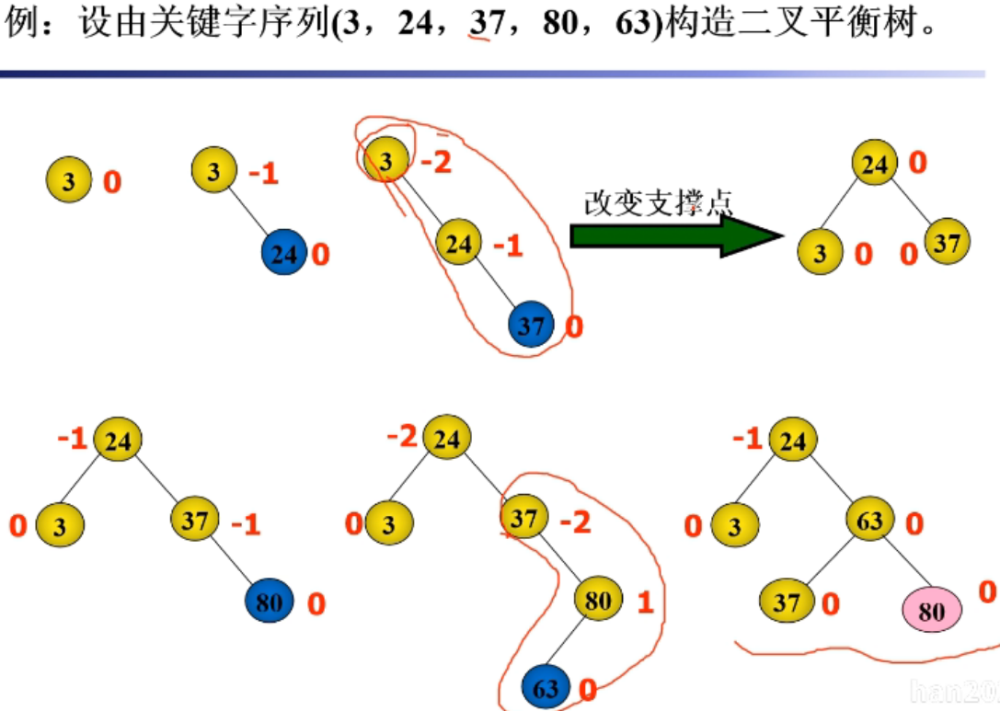
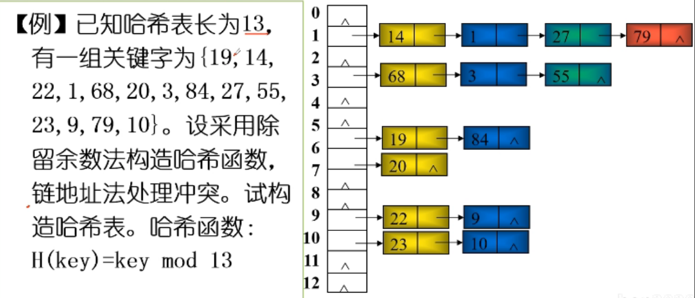

# 字典和集合

[toc]

## BASE

查找表：由同一类型的数据元素构成的集合

平均查找长度：为确定记录在表中的位置，徐鹤检索键进行比较的关键字的个数的期望值

```text
对含有 n 个记录的表， ASL = sum([PiCi])
Pi 为查找表中第 i 个元素的概率 sum([Pi]) = 1
Ci 为找到表中第 i 个元素所需比较次数
```

## 线性查找表

### 顺序查找

平均查找长度：`(n + 1) / 2`

线性表示无序表时，链式存储时，必须采用顺序查找

### 二分查找

设表长 n = 2^h - 1, h = ln(n+1)，即判定树是深度为h的满二叉树
设表中每个记录的查找概率相等 Pi = 1 / n

`((n + 1)ln(n + 1) / n) - 1` 约等于 `(ln(n + 1)) - 1`

等概率查找算法中效率最高的，时间复杂度，O(ln(n))

只适用于有序表，且仅限于顺序存储结构

## 树状查找表

从根结点到任意的平均路径的长度为查找的次数，可以小刀结点个数n的对数

### 二叉排序树

- 二分查找，链式存储
- 如有左子树，则左子树的所有结点的关键字均小于根节点的关键字
- 右子树相反
- 左右子树各是一棵二叉排序树
- 中序遍历是一个递增序列
- 动态查找树
- 查找，插入，删除

#### 二叉排序树查找过程

- 二叉树为空，查找不成功
- 给定值等于根结点关键字，查找成功
- 给定值小于根结点的关键字，则在左子树上查找
- 给定值大于根结点的关键字，则在右子树上查找

查找一个元素的比较次数为该元素所在层次，不会超过树的高度

#### 二叉排序树的插入操作

- 若二叉树为空，插入到根结点
- 在左右子树查找，直到某一节点的左或右子树为空，则插入到其左或右右孩子结点

#### 二叉排序树的删除操作

- p 为叶子结点，将p双亲的左孩子或右孩子域置空
- p 只有一棵子树，用 p 唯一的子孩子替换p
- p 有两棵子树
  - 用 p 左子树中最大元素替换 p，沿左子树的根C的右子树分支找到S，直至S的右子树为空
    - 或右子树最小元素
  - 用S的值替换p的值，将问题转化为删除S结点

#### 二叉排序树的实现

```python
class BstNode:
    def __init__(self, data, l_child=None, r_child=None):
        self.data = data
        self.l_child = l_child
        self.r_child = r_child

class DictBinTree():
    def __init__(self):
        self.root: BstNode = None

    def search(self, key):
        bt = self.root
        while bt is not None:
            if key < bt.data:
                bt = bt.l_child
            elif key > bt.data:
                bt = bt.r_child
            else:
                return bt
        return None

    def insert(self, key):
        bt = self.root
        if bt is None:
            self.root = BstNode(key)
            return
        while True:
            if key < bt.data:
                if bt.l_child is None:
                    bt.l_child = BstNode(key)
                    return
                bt = bt.l_child
            elif key > bt.data:
                if bt.r_child is None:
                    bt.r_child = BstNode(key)
                    return
                bt = bt.r_child
            else:
                return
```

### 平衡二叉树 AVL 树

- 平衡二叉树或为空树，或者符合，左子树，右子树均为平衡二叉树，左右子树深度之差的绝对值不超过一
- 平衡因子：结点的左子树的深度减去右子树的深度
  - 平衡二叉树的平衡因子只可能是 -1 0 1
  - 只要有一个结点的平衡因子的绝对值大于 1 则不再平衡
  - 平衡因子绝对值大于1，则为失衡结点



```text
沿着插入方向，找到最先失衡的结点，从这个节点开始，沿着插入路径。
找离失衡结点最近的三个结点调整平衡，
把值为中间的作为子树的根，小的为左子树，大的为右子树
其他节点根据二叉排序树的性质插入到这个二叉平衡树中
```

## 哈希查找表

关键字 -- 记录的存储的地址

### 哈希函数

- 直接定址法，取关键字或关键字的某线性函数做哈希地址
- 数字分析法，假设关键字集合中的每个关键字都是由n位数字组成，分析关键字集中的全体，并从中提取分布均匀的若干位或他们的组合作为地址
- 平方取中法，
  - 构造：若关键字的每一位都有某些数字重复出现拼读很高的现象，则求关键字的平方值，取中间几位作哈希地址
  - 平方可以扩大差别
  - 平方值的中间几位会受到整个关键字中的各个位的影响
- 除留余数法，H(key) = key mod p, p <= m，p 为不大于哈希表长度m的数字，奇接近于m的素数

### 常用处理哈希冲突方法

为产生冲突的关键字寻找下一个哈西地址

- 开放定址法
  - 冲突发生时，形成一个探查序列，沿此序列地址探查，直到找到一个空位置，将发生冲突的记录放到该地址中，Hi = (H(key) + di) mod m
  - 线性探测再散列，查找线性下一个空地址
  - 二次探测再散列，(余数 + 1^2) mod (p + 1) (余数 - 1^2) mod (p + 1)
  - 伪随机探测再散列
- 链地址法
  - 把所有关键字为同义词的记录存储在一个单链表，并用顺序表存放各链表的头指针
  - 

- 再散列法（双散列函数法）
- 建立一个公共溢出区

### 散列表的查找性能

利用哈希函数计算检索键的哈希地址，将其与该地址的关键字进行比较
如果发生冲突，按处理冲突的方法继续查找
