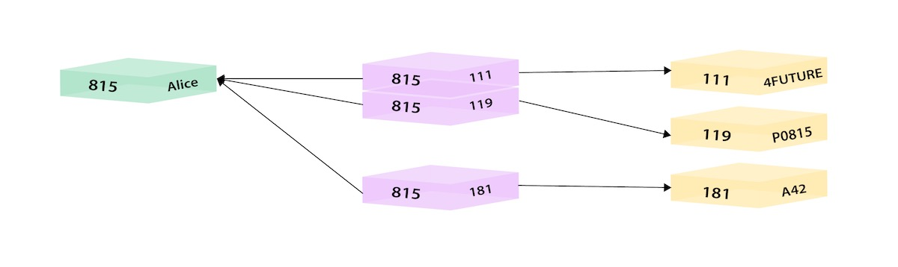
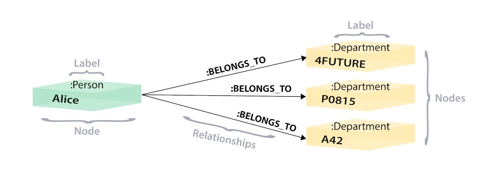

# 关系到图

## 2 数据模型



人员----人员-部门表----部门表



人员----部门

## 3 数据存储和检索

```sql
SELECT name FROM Person
LEFT JOIN Person_Department
  ON Person.Id = Person_Department.PersonId
LEFT JOIN Department
  ON Department.Id = Person_Department.DepartmentId
WHERE Department.name = 'IT Department'
```

```Cypher
MATCH (p:Person)-[:WORKS_AT]->(d:Dept)
WHERE d.name = 'IT Department'
RETURN p.name
```
