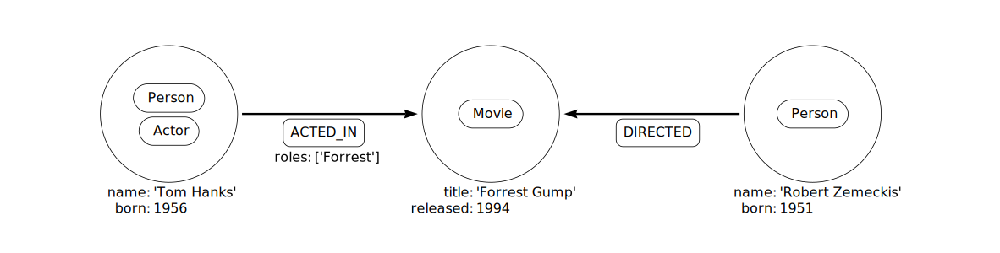
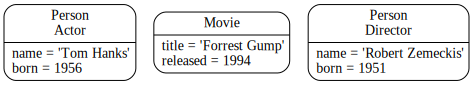

# 图数据库概念

Neo4j

<https://neo4j.com/docs>

## 0 组成

- 节点
- 节点标签
- 关系
  - 关系方向
  - 关系类型
- 节点-关系:属性

## 1 示例图



```Cypher
CREATE (:Person:Actor {name: '汤姆·汉克斯', born: 1956})
-[:ACTED_IN {roles: ['Forrest']}]->(:Movie {title: '阿甘正传'})
<-[:DIRECTED]-(:Person {name: '罗伯特·泽梅基斯', born: 1951})
```

## 2 节点

节点用于表达域的实体(离散对象)

```Cypher
CREATE (:Person:Actor {name: 'Pandora', born: 2385})

# 节点标签：Person, Actor
# 节点属性：name, born
# 创建一个 name=Pandora, born=2385 的 Person,Actor 的节点
```

## 3 节点标签

标签通过将节点分组(分类)为集合来塑造域，具有特定标签的所有节点都属于同一集合



## 4 关系

关系描述了源节点和目标节点之间的连接是如何相关的

- 1 连接源节点与目标节点
- 2 有一个方向
- 3 必须有一个类型，来定义(分类)是什么类型的关系
- 4 可以具有进一步描述关系的属性(键值对)
- 5 必须有源节点与目标节点才能创建关系

```Cypher
CREATE ()-[:ACTION_IN {roles: ['Forrest'], performance: 5}] -> ()

# 关系类型：ACTION_IN
# 属性:
#   roles: ['Forrest']
#   performance: 5
```

## 5 关系类型

关系必须只有一种关系类型

## 6 属性

```Cypher
CREATE (:EXAMPLE {a: 1, v: 3.14})

# 属性 a 具有 类型为 integer 值为 1
```

## 7 遍历和路径

遍历图是指按照一定的规则遵循关系来访问节点。在大多数情况下，仅访问图的一个子集

## 8 Schema

指索引和约束

## 9 Indexes 索引

## 10 Constraints 约束

## 11 Naming conventions 命名约定

节点标签、关系类型和属性（关键部分）区分大小写

- 节点：VehicleOwner
- 关系类型：OWNS_VEHICLE
- 属性：firstName
