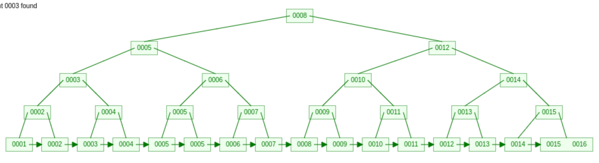

# B+Tree

B-Tree变种，多路平衡树

- 非叶子节点不存储data，(父节点存索引，叶子节点存数据)，可以存放更多的索引
- 叶子节点包含所有索引字段
- 叶子节点用指针连接，提高区间访问的性能

## MySQL 索引

应该只为最经常查询和最经常排序的数据列建立索引。

MySQL里同一个数据表里的索引总数限制为16个。

InnoDB索引实现（聚集）

- 表数据文件本身是按照 B+Tree 组织的一个索引结构文件
- 聚集索引-叶节点包含了完整的数据记录
- 非主键索引结构子节点存储的是主键值，一致性和节省存储空间

## 聚集索引与非聚集索引

- 聚集索引就是存放的物理顺序和列中的顺序一样。一般设置主键索引就为聚集索引。
- 一个表只能有一个聚集索引，非聚集索引一张表可以有多个。
- 通过聚集索引可以一次直接查到需要查找的数据， 而通过非聚集索引第一次只能查到记录对应的主键值， 再使用主键的值通过聚集索引查找到需要的数据。

## B-Tree

- 叶节点具有相同深度，叶节点指针为空
- 索引元素不重复
- 节点中的数据索引从左到东递增排列
